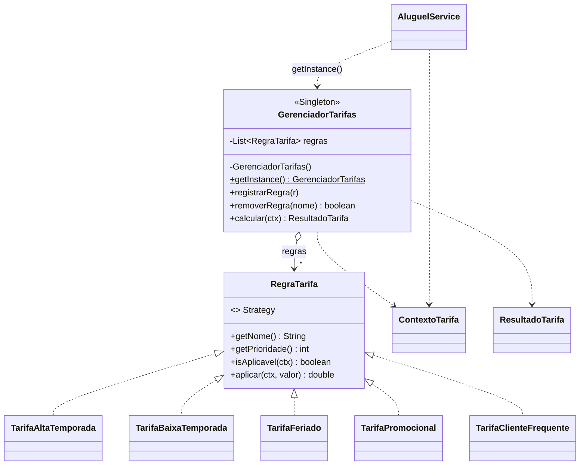
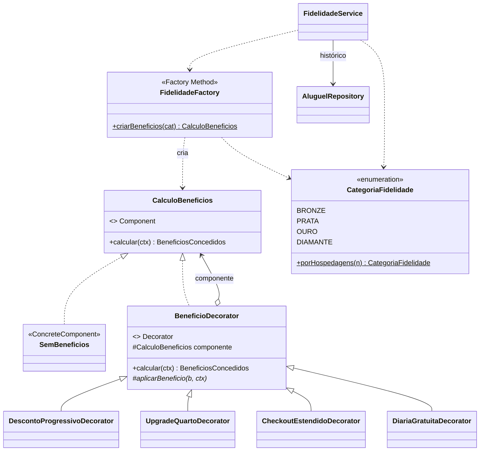

# Diagrama de Classes — Sprint 4

Diagramas com foco nos **padrões de projeto** introduzidos nesta sprint e em como
as classes novas se relacionam com as já existentes (`AluguelService`,
`Aluguel`, `Cliente`, `AluguelRepository`).

> Versão renderizável também disponível em PlantUML:
> [`diagrama_sprint4.puml`](diagrama_sprint4.puml).
>
> Visão consolidada (todas as classes novas + núcleo existente em uma única
> imagem, útil para apresentação rápida): [`diagrama_visao_geral.png`](diagrama_visao_geral.png).

## 1. Tarifação Flexível — Strategy + Singleton

## 2. Programa de Fidelidade — Decorator + Factory Method

